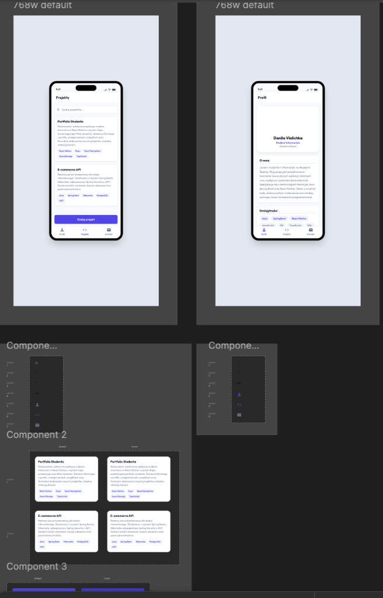
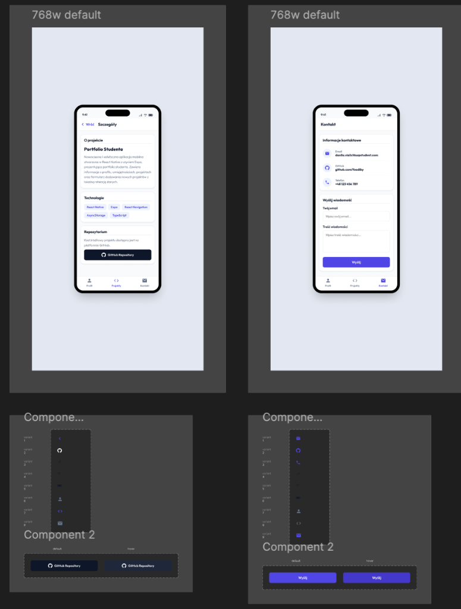
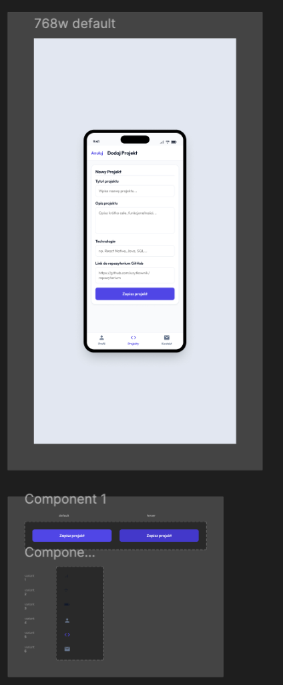

# Portfolio Studenta - Mobilna Aplikacja Akademicka (React Native / Expo)

Projekt mobilnej aplikacji akademickiej przygotowany przez studenta **Danila Vialichka** (Informatyka, Akademia Śląska) w ramach przedmiotu **Programowanie Urządzeń Mobilnych**. Aplikacja stanowi w pełni funkcjonalne, interaktywne portfolio prezentujące sylwetkę akademicką i zawodową autora. System umożliwia przeglądanie projektów programistycznych, dynamiczne dodawanie nowych przedsięwzięć z poziomu urządzenia z trwałą retencją danych w pamięci lokalnej, a także oferuje zintegrowany kanał komunikacyjny z autorem.

---

## 🎨 Makiety Projektowe (Figma Mockups)

Interfejs użytkownika został zaprojektowany w programie Figma z dbałością o zasady UX/UI oraz spójność wizualną (tryb jasny w nowoczesnej stylistyce Slate/Indigo). Poniżej przedstawiono widoki z projektu przygotowanego w programie Figma:

<p align="center">
  
  &nbsp;&nbsp;&nbsp;&nbsp;
  
</p>
<p align="center">
  
</p>

---

## 🚀 Architektura i Funkcjonalności Systemu

Aplikacja składa się z pięciu głównych ekranów zorganizowanych w hybrydową strukturę nawigacyjną:

1. **Karta Profilu Studenta**:
   * Prezentacja wizerunku (avatar), specjalizacji oraz danych uczelnianych (Akademia Śląska).
   * Sekcja "O mnie" zawierająca opis celów zawodowych.
   * Dynamiczny zbiór umiejętności technicznych (tagi z podziałem na wiodące i uzupełniające).

2. **Katalog Projektów z Wyszukiwarką**:
   * Komponent listy prezentujący zrealizowane projekty komercyjne oraz akademickie.
   * Wbudowany moduł wyszukiwania filtrujący w czasie rzeczywistym projekty na podstawie nazwy oraz użytych technologii.
   * Skalowalne tagowanie technologii użytych w każdym z projektów.

3. **Szczegóły Projektu**:
   * Dedykowany ekran prezentacji wybranego projektu z pełnym opisem technicznym.
   * Spis technologii.
   * Bezpośrednie przekierowanie URL do repozytorium kodu w serwisie GitHub za pomocą natywnego modułu Linking API.

4. **Kreator Projektów (Formularz)**:
   * Formularz wejściowy umożliwiający dodawanie nowych projektów.
   * Pełna walidacja danych (wymagane pola tekstowe, poprawność formatowania linków URL repozytorium GitHub).

5. **Trwałość Danych (Lokalna Baza Danych)**:
   * Integracja z silnikiem **AsyncStorage** do lokalnego zapisywania danych w pamięci flash urządzenia. Dane projektowe nie ulegają zresetowaniu po ubiciu procesu aplikacji.

6. **Moduł Kontaktowy**:
   * Dane teleadresowe (Email, GitHub, Telefon) z obsługą natywnych intencji systemowych.
   * Formularz kontaktowy z walidacją struktury adresu email oraz niepustości wiadomości.

---

## 🛠️ Stos Technologiczny (Tech Stack)

Aplikacja została zbudowana w oparciu o najnowsze standardy środowiska mobilnego:

* **Framework Główny**: React Native (wersja oparta na stabilnym **Expo SDK 56**)
* **Język programowania**: TypeScript (z pełnym typowaniem interfejsów i stanów)
* **Nawigacja**: React Navigation (Bottom Tab Navigator jako główny kontener + Native Stack Navigator do głębokiej nawigacji)
* **Zarządzanie Stanem i Magazyn Danych**: React Context API zintegrowany z `@react-native-async-storage/async-storage`
* **Warstwa Wizualna**: Style definiowane za pomocą StyleSheet z centralnym repozytorium tokenów projektowych (paleta kolorów, fonty, cienie, marginesy)

---

## 💻 Instrukcja Uruchomienia Środowiska Deweloperskiego

W celu przetestowania lub uruchomienia aplikacji na własnym urządzeniu mobilnym bądź emulatorze, postępuj zgodnie z poniższymi instrukcjami:

### Wymagania Wstępne
* Środowisko **Node.js** (wersja 18.x lub nowsza).
* Zainstalowany pakiet **Expo Go** na fizycznym telefonie komórkowym (App Store / Google Play) lub działający emulator (Xcode Simulator / Android Studio Emulator).

### Instalacja i Uruchomienie

1. **Sklonuj repozytorium projektu**:
   ```bash
   git clone https://github.com/foodiby/portfolia_zaliczenie.git
   cd portfolia_zaliczenie
   ```

2. **Zainstaluj zależności npm**:
   ```bash
   npm install
   ```

3. **Uruchom serwer Metro Bundler**:
   ```bash
   npx expo start
   ```

4. **Uruchomienie na wybranym urządzeniu**:
   * Zeskanuj wygenerowany kod QR za pomocą aplikacji **Expo Go** na telefonie.
   * Aby uruchomić w iOS Simulator, naciśnij klawisz `i` w oknie terminala.
   * Aby uruchomić w Android Emulator, naciśnij klawisz `a` w oknie terminala.

---

## 📁 Struktura Projektu

Struktura katalogów została zaprojektowana zgodnie z zasadą Modular-by-Feature:

```text
portfolia_zaliczenie/
├── assets/                  # Pliki binarne (grafiki profilowe, makiety)
│   └── mockups/             # Makiety i ekrany zaprojektowane w programie Figma
├── src/
│   ├── components/          # Reużywalne komponenty interfejsu (Button, Input, SkillTag itp.)
│   ├── context/             # Warstwa stanowa aplikacji (zarządzanie projektami)
│   ├── navigation/          # Konfiguracja tras i przejść ekranów (AppNavigator)
│   ├── screens/             # Ekrany docelowe (Profile, Projects, AddProject, Details, Contact)
│   └── theme/               # Tokeny wizualne i stałe stylów (kolory, cienie, rozmiary)
├── App.tsx                  # Punkt startowy aplikacji
├── app.json                 # Konfiguracja środowiska Expo
└── tsconfig.json            # Konfiguracja kompilatora TypeScript
```
